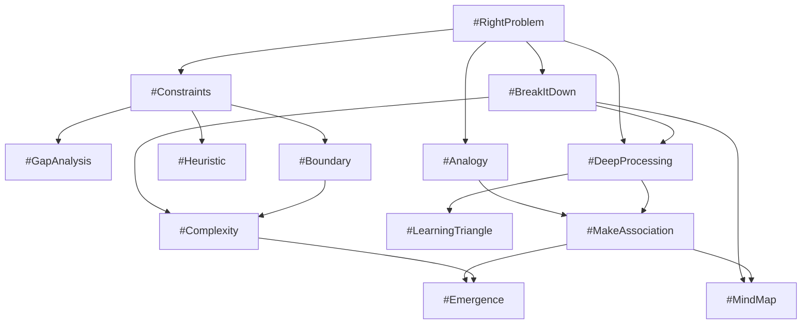
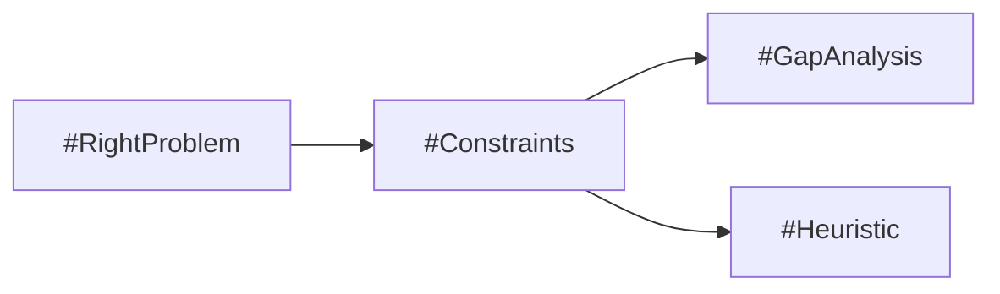
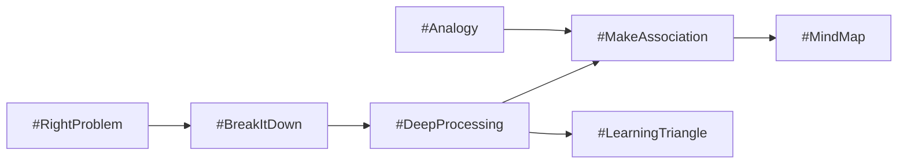
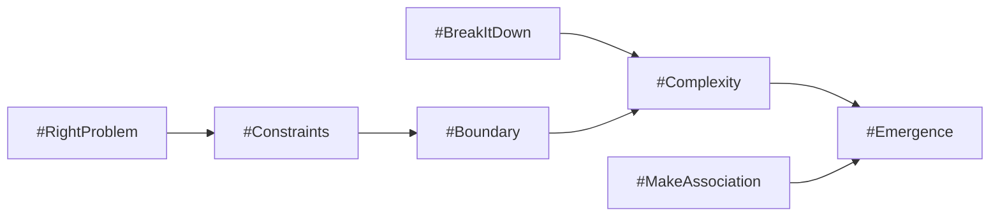

# Thinking Graph

## Directed reasoning network

ThinkingOS models its skill ecosystem as a directed graph. Each node is a single Thinking Skill; each edge points from a prerequisite skill to a skill that can consume its validated outputs.

The graph is not a mandatory linear workflow. The Engine selects a path from the current goal, available inputs, dependency readiness, and skill transition conditions. A consumer may skip a prerequisite only when equivalent, schema-compatible inputs already exist and validation confirms their quality.

## Graph semantics

- **Node:** A versioned skill registered in `skills/registry.yaml`.
- **Edge:** A declared prerequisite relationship, not an automatic invocation.
- **Input contract:** The consumer's `consumes` values describe the semantic data it expects.
- **Output contract:** The producer's `produces` values describe reusable results available to downstream skills.
- **State:** Conversation state records the active node, collected inputs, pending questions, and recommended next node.
- **Traversal:** The Engine recommends the next valid skill; the accountable user or host application controls execution.

## Typical paths

### Problem to action

This path validates the problem, establishes the feasible space, then identifies gaps or constructs a bounded decision shortcut.

### Understanding to synthesis

This path decomposes and elaborates a problem before creating associations, a concept graph, or a learning plan.

### Systems thinking

This path establishes scope before evaluating interactions, uncertainty, and emergent behavior.

## Evolution

Registry dependencies define the authoritative graph. Documentation diagrams are explanatory views and must be updated when registry edges change. New nodes should reuse existing inputs and outputs where semantics match, avoid cycles unless a future orchestration specification explicitly supports iteration, and preserve AI-platform independence.
