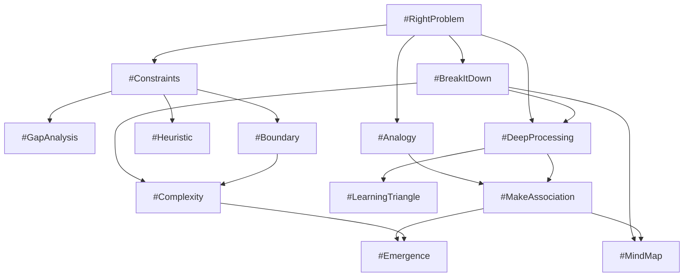
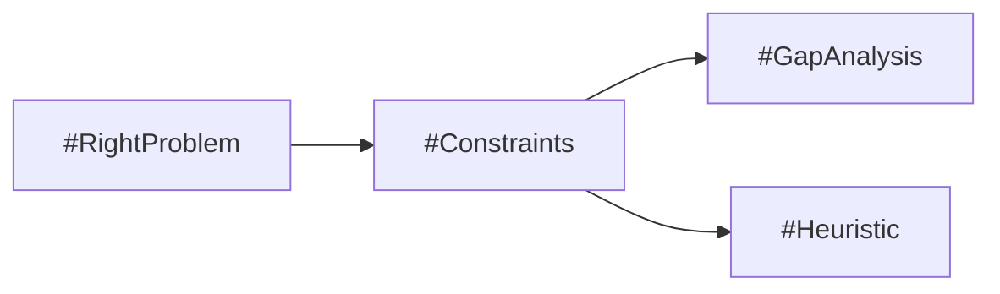
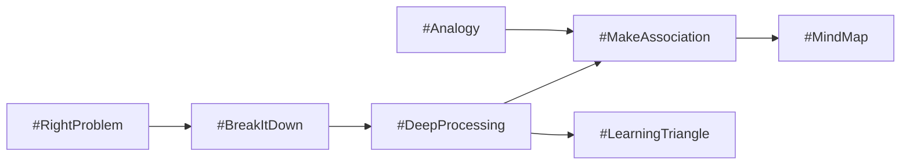
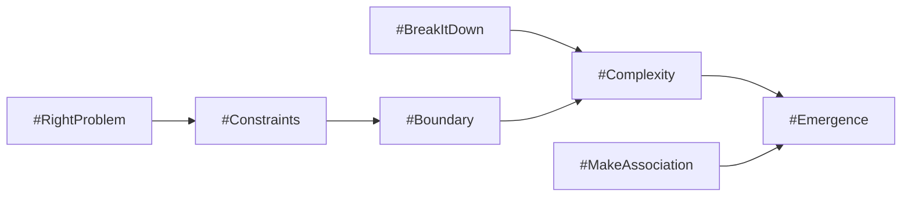

# 思考圖譜

## 有向推理網路

ThinkingOS 將技能生態建模為有向圖。每個節點是一個 Thinking Skill，每條邊從前置技能指向能消費其已驗證輸出的技能。

這不是強制線性流程。Engine 根據目前目標、可用輸入、相依就緒度及轉換條件選路徑；只有已存在等價且相容的輸入，並通過品質驗證時，才能略過前置技能。

## 圖譜語意

- **節點：** `skills/registry.yaml` 中具版本的技能。
- **邊：** 宣告的前置關係，不代表自動呼叫。
- **輸入契約：** 消費者的 `consumes` 表示預期語意資料。
- **輸出契約：** 生產者的 `produces` 表示可供下游使用的結果。
- **狀態：** 記錄目前節點、收集輸入、待回答問題與建議下一節點。
- **遍歷：** Engine 建議下一個有效技能；負責的使用者或 Host 控制執行。

## 常見路徑

### 從問題到行動

先驗證問題並建立可行空間，再找出差距或建立有邊界的決策捷思。

### 從理解到統整

先分解並深化概念，再建立關聯、概念圖或學習計畫。

### 系統思考

先建立範圍，再評估互動、不確定性與湧現行為。

## 演進

Registry 是權威圖譜，邊變更時文件圖也要更新。新節點應重用語意相符的輸入與輸出、避免循環，並維持 AI 平台中立。
